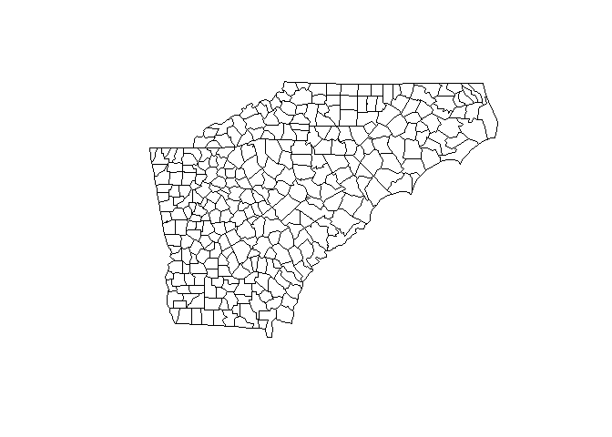
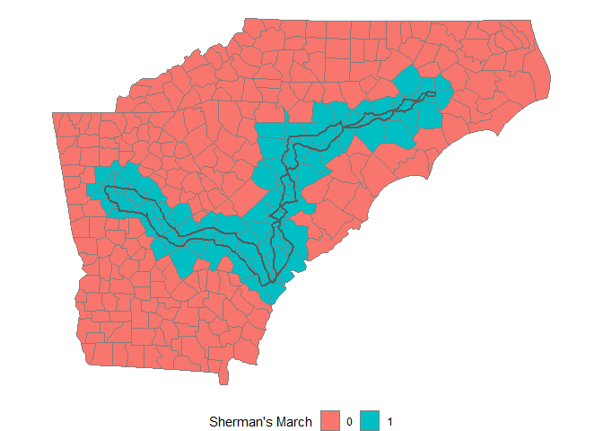
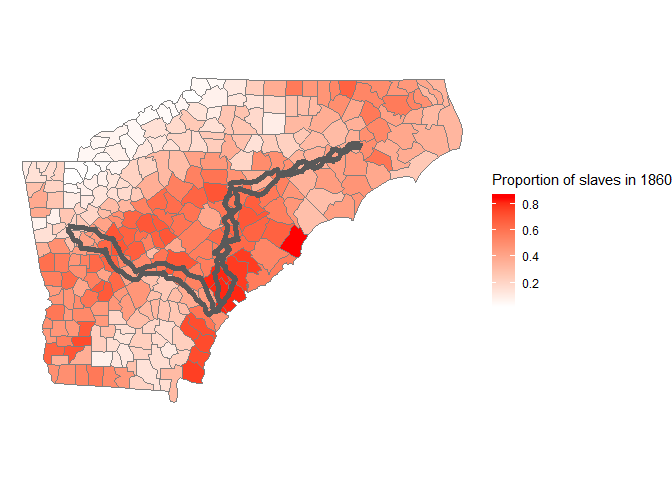
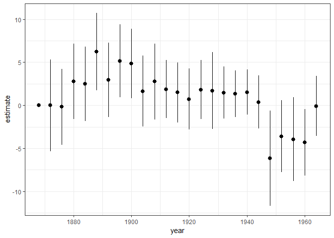

Code
================
Martin Kosík
23 červenec, 2019

``` r
knitr::opts_chunk$set(echo = TRUE)
library(tidyverse)
library(here)
library(sf)
library(mapview)
library(USAboundaries)
library(broom)
```

``` r
sherman_march_map <- st_read(here::here("maps/sherman_march/sherman_march_shapefile.shp"))
```

    ## Reading layer `sherman_march_shapefile' from data source `C:\Users\Martin\Desktop\research_projects\sherman-march\maps\sherman_march\sherman_march_shapefile.shp' using driver `ESRI Shapefile'
    ## Simple feature collection with 2 features and 1 field
    ## geometry type:  LINESTRING
    ## dimension:      XY
    ## bbox:           xmin: -84.53347 ymin: 32.0493 xmax: -77.80179 ymax: 35.33569
    ## epsg (SRID):    4326
    ## proj4string:    +proj=longlat +datum=WGS84 +no_defs

``` r
#plot(sherman_march_map)
counties  <- us_counties(states = c("Georgia", "North Carolina", "South Carolina")) %>% 
  mutate(fips = as.numeric(paste0(statefp, countyfp)))

counties_1860  <- us_counties(states = c("1860-09-17", "Georgia", "North Carolina", "South Carolina")) %>% 
  mutate(fips = as.numeric(paste0(statefp, countyfp)))

plot(counties_1860$geometry)
plot(counties$geometry)
```



``` r
#str(counties)
```

``` r
march_buffer_10km <- sherman_march_map %>% 
  st_transform(crs = 7801) %>% 
  st_buffer(dist = 10000, nQuadSegs = 1) 


march_buffer_5miles <- sherman_march_map %>% 
  st_transform(crs = 7801) %>% 
  st_buffer(dist = 8046.72, nQuadSegs = 1) 


#mapview(counties)
```

``` r
march_counties <- counties %>% 
  st_transform(crs = 7801) %>% 
  st_intersection(march_buffer_5miles) %>% 
  st_set_geometry(NULL) %>% 
 # st_transform(crs = "+proj=longlat +datum=WGS84 +no_defs") %>% 
  dplyr::select(fips) %>% 
  mutate(march = 1)
```

    ## Warning: attribute variables are assumed to be spatially constant
    ## throughout all geometries

``` r
counties <- counties %>% 
  left_join(march_counties, by = "fips") %>% 
  mutate(march = ifelse(is.na(march), 0, march))

counties %>% 
  ggplot(aes(fill = as.factor(march))) +
    geom_sf(color = "gray50", size = 0.5) +
   # geom_sf(data = st_transform(march_counties, crs = "+proj=longlat +datum=WGS84 +no_defs"), fill = "gray50")+
    theme_void() +
    coord_sf(crs = "+proj=longlat +datum=WGS84 +no_defs", ndiscr = F) + 
    labs(fill = "Sherman's March") + 
    theme(legend.position="bottom")
```



``` r
county_data <- read_csv("data/acharya_et_al_2016_county_data.csv")
```

    ## Warning: Missing column names filled in: 'X1' [1]

    ## Parsed with column specification:
    ## cols(
    ##   .default = col_double(),
    ##   X1 = col_integer(),
    ##   state.abb = col_character(),
    ##   fips = col_integer(),
    ##   county_name = col_character(),
    ##   coarea = col_integer(),
    ##   rail1860 = col_integer(),
    ##   water1860 = col_integer(),
    ##   nmatch.diff.20 = col_integer(),
    ##   totpop00 = col_integer(),
    ##   medinc00 = col_integer(),
    ##   livstock = col_integer(),
    ##   livstock1870 = col_integer(),
    ##   farmval = col_integer(),
    ##   farmval1870 = col_integer(),
    ##   totpop1880 = col_integer(),
    ##   totpop1890 = col_integer(),
    ##   totpop10 = col_integer(),
    ##   totpop20 = col_integer(),
    ##   totpop30 = col_integer(),
    ##   totpop40 = col_integer()
    ##   # ... with 10 more columns
    ## )

    ## See spec(...) for full column specifications.

``` r
county_data <- county_data %>% 
  right_join(counties, by = c("fips"))


lm(pdem1852 ~ march + pslave1860, data = county_data) %>% 
  summary()
```

    ## 
    ## Call:
    ## lm(formula = pdem1852 ~ march + pslave1860, data = county_data)
    ## 
    ## Residuals:
    ##     Min      1Q  Median      3Q     Max 
    ## -42.649 -10.302  -0.401  12.923  43.779 
    ## 
    ## Coefficients:
    ##             Estimate Std. Error t value Pr(>|t|)    
    ## (Intercept)   43.989      3.206   13.72   <2e-16 ***
    ## march          6.670      3.074    2.17   0.0313 *  
    ## pslave1860    19.563      7.524    2.60   0.0101 *  
    ## ---
    ## Signif. codes:  0 '***' 0.001 '**' 0.01 '*' 0.05 '.' 0.1 ' ' 1
    ## 
    ## Residual standard error: 18.57 on 184 degrees of freedom
    ##   (154 observations deleted due to missingness)
    ## Multiple R-squared:  0.07608,    Adjusted R-squared:  0.06604 
    ## F-statistic: 7.576 on 2 and 184 DF,  p-value: 0.0006891

``` r
fit_model <- function(dep_var, controls = ""){
 lm(as.formula(paste0(dep_var, " ~ march", controls)), data = county_data) %>% 
  tidy(conf.int = TRUE)
}


pdem <- paste0("pdem", seq(from = 1868, to = 1964, by = 4))


pdem_march_coefs <- map(pdem, fit_model) %>% 
  set_names(pdem) %>% 
  map2(pdem, ~ mutate(.x, year = .y)) %>% 
  bind_rows() %>% 
  filter(term == "march") %>% 
  mutate(year = as.numeric(str_sub(year, start = -4)))
```

``` r
pdem_march_coefs %>% 
  ggplot(aes(x = year, y = estimate, ymin = conf.low, ymax = conf.high)) + 
  geom_pointrange() + 
  theme_bw()
```



``` r
pdem_march_coefs_slave_control <- map(pdem, ~ fit_model(dep_var = ., controls = "+ pslave1860")) %>% 
  set_names(pdem) %>% 
  map2(pdem, ~ mutate(.x, year = .y)) %>% 
  bind_rows() %>% 
  filter(term == "march") %>% 
  mutate(year = as.numeric(str_sub(year, start = -4)))
```

``` r
pdem_march_coefs_slave_control %>% 
  ggplot(aes(x = year, y = estimate, ymin = conf.low, ymax = conf.high)) + 
  geom_pointrange() + 
  theme_bw()
```


