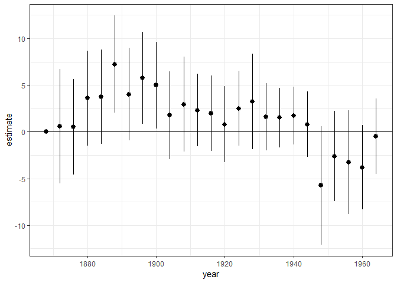

Code
================
Martin Kosík
27 červenec, 2019

``` r
knitr::opts_chunk$set(echo = TRUE)
library(tidyverse)
library(here)
library(sf)
library(mapview)
library(USAboundaries)
library(broom)
```

``` r
sherman_march_map <- st_read(here::here("maps/sherman_march/sherman_march_shapefile.shp"))
```

    ## Reading layer `sherman_march_shapefile' from data source `C:\Users\Martin\Desktop\research_projects\sherman-march\maps\sherman_march\sherman_march_shapefile.shp' using driver `ESRI Shapefile'
    ## Simple feature collection with 2 features and 1 field
    ## geometry type:  LINESTRING
    ## dimension:      XY
    ## bbox:           xmin: -84.53347 ymin: 32.0493 xmax: -77.80179 ymax: 35.33569
    ## epsg (SRID):    4326
    ## proj4string:    +proj=longlat +datum=WGS84 +no_defs

``` r
#plot(sherman_march_map)
counties  <- us_counties(states = c("Georgia", "North Carolina", "South Carolina")) %>% 
  mutate(fips = as.numeric(paste0(statefp, countyfp)))

counties_1860  <- us_counties(states = c("1866-09-17", "Georgia", "North Carolina", "South Carolina")) %>% 
  mutate(fips = as.numeric(paste0(statefp, countyfp)))

conf_mon <- read_csv(here::here("data/conf_monuments.csv")) %>% 
  separate(Coordinates, into = c("lon", "lat"), sep = ", ", remove = FALSE, convert = TRUE) %>% 
  mutate(lon = as.numeric(lon), 
         lat = as.numeric(lat)) %>% 
  filter(!is.na(lon)) %>% 
  st_as_sf(coords = c("lat","lon"), crs = 4326) # %>% st_set_crs("+proj=longlat +datum=WGS84 +no_defs")
```

    ## Parsed with column specification:
    ## cols(
    ##   `Unique ID` = col_integer(),
    ##   feature_name = col_character(),
    ##   Honoree = col_character(),
    ##   City = col_character(),
    ##   County = col_character(),
    ##   State = col_character(),
    ##   Side = col_character(),
    ##   Coordinates = col_character(),
    ##   `Symbol Type` = col_character(),
    ##   `Symbol Category` = col_character(),
    ##   Sponsor = col_character(),
    ##   `Year Dedicated` = col_character(),
    ##   `Year Removed` = col_character(),
    ##   `Was this symbol removed?` = col_character(),
    ##   Location = col_character()
    ## )

    ## Warning: Expected 2 pieces. Missing pieces filled with `NA` in 1 rows
    ## [794].

    ## Warning in evalq(as.numeric(lon), <environment>): NAs introduced by
    ## coercion

``` r
#mapview(conf_mon)

mon_by_county <- counties %>% 
  st_join(conf_mon) %>% 
  st_set_geometry(NULL) %>% 
  group_by(fips) %>% 
  summarize(monuments = sum(!is.na(feature_name))) 
```

    ## although coordinates are longitude/latitude, st_intersects assumes that they are planar

``` r
march_buffer_10km <- sherman_march_map %>% 
  st_transform(crs = 7801) %>% 
  st_buffer(dist = 10000, nQuadSegs = 1) 


march_buffer_5miles <- sherman_march_map %>% 
  st_transform(crs = 7801) %>% 
  st_buffer(dist = 8046.72, nQuadSegs = 1) 


#mapview(counties)
```

``` r
march_counties <- counties %>% 
  st_transform(crs = 7801) %>% 
  st_intersection(march_buffer_5miles) %>% 
  st_set_geometry(NULL) %>% 
  distinct(fips) %>% #count(fips, sort = T)
  dplyr::select(fips) %>% 
  mutate(march = 1)
```

    ## Warning: attribute variables are assumed to be spatially constant
    ## throughout all geometries

``` r
counties <- counties %>% 
  left_join(march_counties, by = "fips") %>% 
  left_join(mon_by_county, by = "fips") %>% 
  mutate(march = ifelse(is.na(march), 0, march), 
         monuments_dummy = ifelse(monuments == 0, 0, 1))

counties %>% 
  ggplot(aes(fill = as.factor(march))) +
    geom_sf(color = "gray50", size = 0.5) +
    geom_sf(data = st_transform(sherman_march_map, crs = "+proj=longlat +datum=WGS84 +no_defs"), fill = "black", size = 1)+
    theme_void() +
    coord_sf(crs = "+proj=longlat +datum=WGS84 +no_defs", ndiscr = F) + 
    labs(fill = "Sherman's March") + 
    theme(legend.position="bottom")
```


``` r
county_data <- read_csv("data/acharya_et_al_2016_county_data.csv")

county_data <- county_data %>% 
  right_join(counties, by = c("fips"))

#county_data <- county_data %>% 
#  full_join(counties, by = c("fips")) %>% 
#  mutate(march = ifelse(is.na(march), 0, march))
```

``` r
county_data %>% 
  ggplot(aes(fill = pslave1860)) +
    geom_sf(color = "gray50", size = 0.5) +
    geom_sf(data = st_transform(sherman_march_map, crs = "+proj=longlat +datum=WGS84 +no_defs"), fill = "black", size = 2)+
    theme_void() +
    coord_sf(crs = "+proj=longlat +datum=WGS84 +no_defs", ndiscr = F) + 
    labs(fill = "Proportion of slaves in 1860") +
    scale_fill_gradient(low = "white", high = "red")
```


``` r
county_data %>% 
  ggplot(aes(fill = pdem1900)) +
    geom_sf(color = "gray50", size = 0.5) +
    geom_sf(data = st_transform(sherman_march_map, crs = "+proj=longlat +datum=WGS84 +no_defs"), fill = "black", size = 2)+
    theme_void() +
    coord_sf(crs = "+proj=longlat +datum=WGS84 +no_defs", ndiscr = F) + 
    labs(fill = "Proportion of vote for Democrats  in 1900") +
    scale_fill_gradient(low = "white", high = "red") +
   theme(legend.position="bottom")
```


``` r
lm(lynchrate ~ march + pslave1860, data = county_data) %>% 
  summary()
```

    ## 
    ## Call:
    ## lm(formula = lynchrate ~ march + pslave1860, data = county_data)
    ## 
    ## Residuals:
    ##        Min         1Q     Median         3Q        Max 
    ## -2.402e-04 -9.869e-05 -5.139e-05  3.769e-05  8.076e-04 
    ## 
    ## Coefficients:
    ##               Estimate Std. Error t value Pr(>|t|)    
    ## (Intercept)  3.605e-05  2.054e-05   1.755   0.0803 .  
    ## march       -3.791e-05  2.416e-05  -1.569   0.1177    
    ## pslave1860   2.402e-04  4.969e-05   4.834 2.15e-06 ***
    ## ---
    ## Signif. codes:  0 '***' 0.001 '**' 0.01 '*' 0.05 '.' 0.1 ' ' 1
    ## 
    ## Residual standard error: 0.0001646 on 296 degrees of freedom
    ##   (6 observations deleted due to missingness)
    ## Multiple R-squared:  0.07319,    Adjusted R-squared:  0.06692 
    ## F-statistic: 11.69 on 2 and 296 DF,  p-value: 1.303e-05

``` r
fit_model <- function(dep_var, controls = ""){
 lm(as.formula(paste0(dep_var, " ~ march", controls)), data = county_data) %>% 
  tidy(conf.int = TRUE)
}


pdem <- paste0("pdem", seq(from = 1868, to = 1964, by = 4))


pdem_march_coefs <- map(pdem, fit_model) %>% 
  set_names(pdem) %>% 
  map2(pdem, ~ mutate(.x, year = .y)) %>% 
  bind_rows() %>% 
  filter(term == "march") %>% 
  mutate(year = as.numeric(str_sub(year, start = -4)))
```

``` r
pdem_march_coefs %>% 
  ggplot(aes(x = year, y = estimate, ymin = conf.low, ymax = conf.high)) + 
  geom_pointrange() + 
  theme_bw()
```


``` r
pdem_march_coefs_slave_control <- map(pdem, ~ fit_model(dep_var = ., controls = "+ pslave1860")) %>% 
  set_names(pdem) %>% 
  map2(pdem, ~ mutate(.x, year = .y)) %>% 
  bind_rows() %>% 
  filter(term == "march") %>% 
  mutate(year = as.numeric(str_sub(year, start = -4)))
```

``` r
pdem_march_coefs_slave_control %>% 
  ggplot(aes(x = year, y = estimate, ymin = conf.low, ymax = conf.high)) + 
  geom_pointrange() + 
  theme_bw() + geom_hline(yintercept = 0, col = "black")
```



``` r
lm(monuments_dummy ~ march + pslave1860, data = county_data) %>% 
  summary()
```

    ## 
    ## Call:
    ## lm(formula = monuments_dummy ~ march + pslave1860, data = county_data)
    ## 
    ## Residuals:
    ##     Min      1Q  Median      3Q     Max 
    ## -0.8943 -0.5595  0.2602  0.3506  0.4723 
    ## 
    ## Coefficients:
    ##             Estimate Std. Error t value Pr(>|t|)    
    ## (Intercept)   0.5133     0.0575   8.926   <2e-16 ***
    ## march         0.1006     0.0677   1.485   0.1385    
    ## pslave1860    0.3453     0.1380   2.502   0.0129 *  
    ## ---
    ## Signif. codes:  0 '***' 0.001 '**' 0.01 '*' 0.05 '.' 0.1 ' ' 1
    ## 
    ## Residual standard error: 0.464 on 302 degrees of freedom
    ## Multiple R-squared:  0.03761,    Adjusted R-squared:  0.03124 
    ## F-statistic: 5.901 on 2 and 302 DF,  p-value: 0.003062

``` r
#lm(monuments ~ march + pslave1860, data = county_data) %>% 
#  summary()
```
